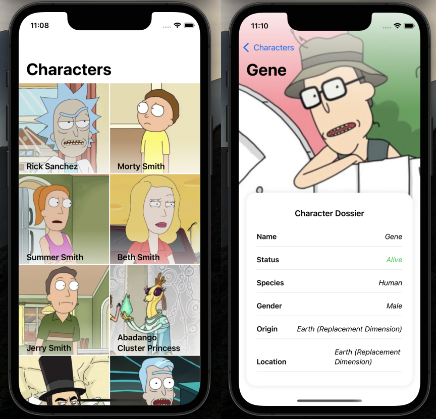

# SampleApp
Esta app está hecha como test técnico en Enero de 2024. 
Con ella se pretende presentar la estructura de un proyecto iOS.

## Contexto
 - Se ha decidido realizar la app sin ninguna librería externa
 - Para realizar el ejercicio se ha utilizado SwiftUI para crea la interfaz
 - Se ha utilizado [The Rick and Morty API](https://rickandmortyapi.com/) para obtener los datos
 
## Objetivos
- Mostrar un listado de personajes
- Mostrar un detalle de personaje
- Incluir tests unitarios
- Utilizar arquitectura MVVM
- Implementar un UX/UI razonable
- Utilizar async-await para obtener el código más limpio posible

## Capturas

